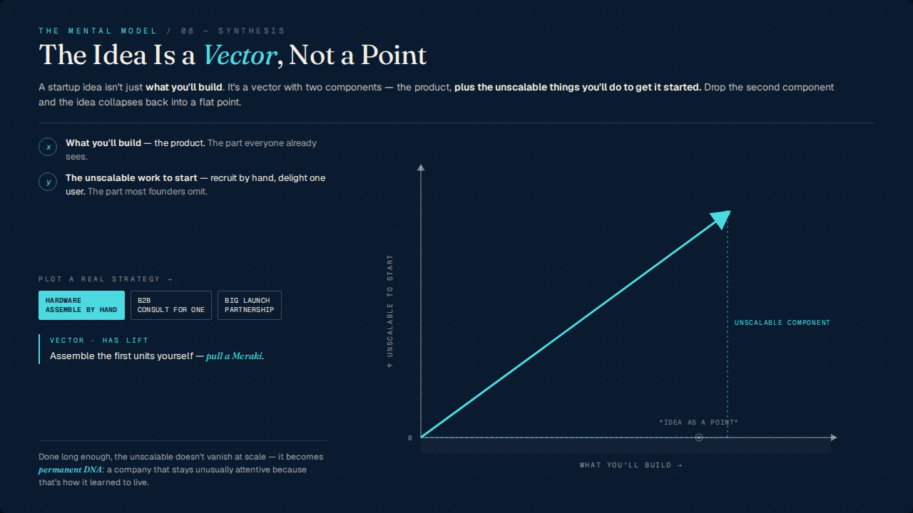
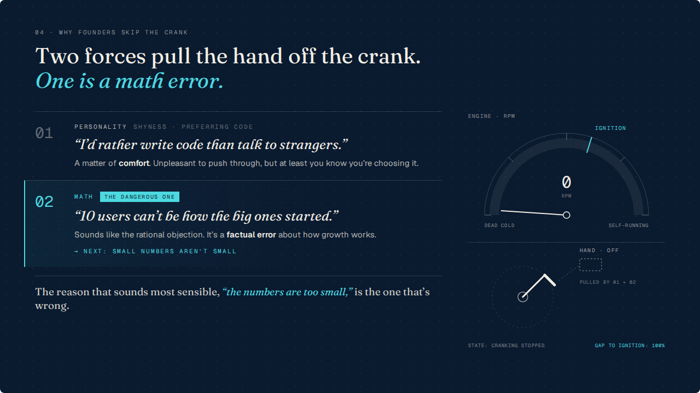
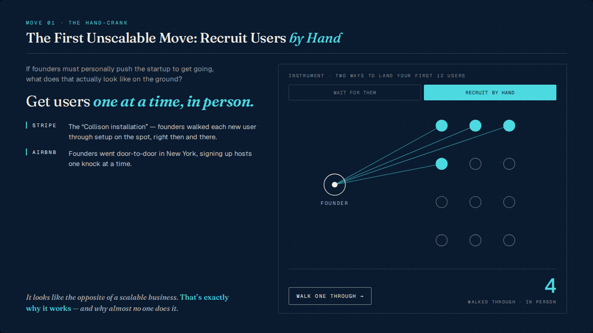
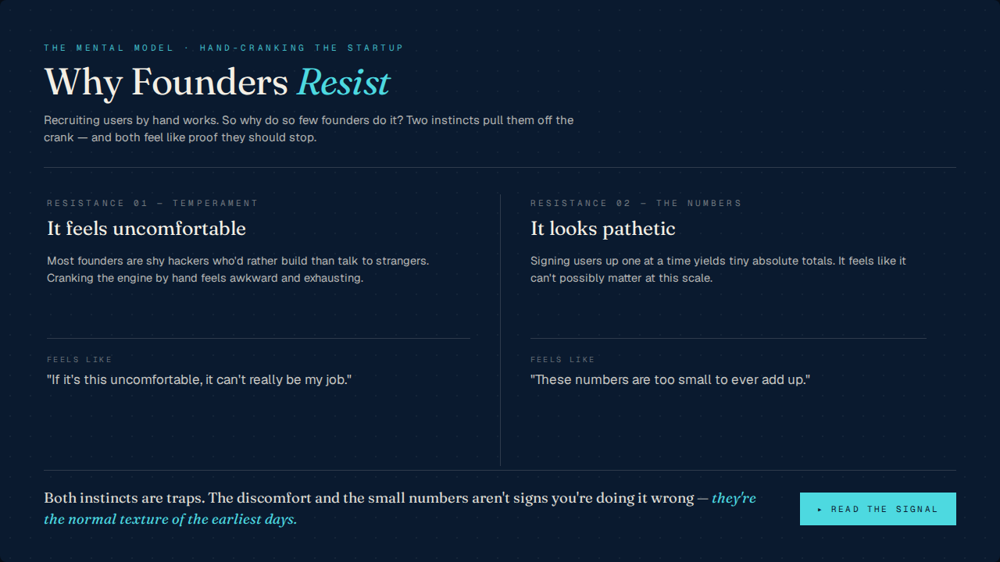
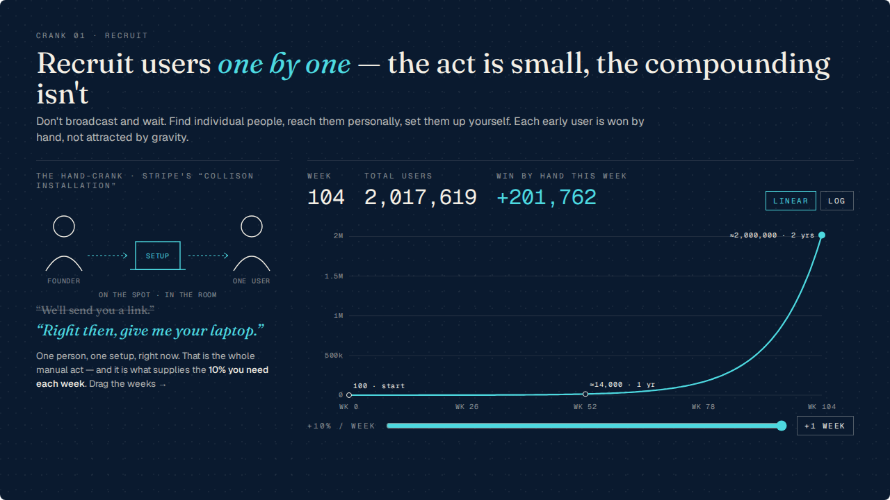

# Baseline eval — current harness, every role on Opus 5.5

_Run `2026-10-04-baseline-opus-5-5` · harness roles: `claude-opus-5-5` (default efforts) · judges: `claude-opus-5-5` (medium) · generated by `bun run eval:report --run 2026-10-04-baseline-opus-5-5`._

Rubric: [eval/RUBRIC.md](../../RUBRIC.md). Scores are 1–4 (pass ≥ 3); "–" = not applicable or unknown. Screenshots for every slide are under `scores/<deck>/shots/`.

## The key question

**Of the 20 Opus 5.5 slides that passed the harness's mechanical gate (0 overflow, 0 console errors), 1 (5%) scored < 3 on claim_at_rest, mechanism_shown or device_works.**

By criterion (a slide can fail several): mechanism_shown 1.
Opus 4.8 reference deck (outline-only, no plan): 3 of 8 gate-passing slides (38%).

## Summary

| deck | slides | claim | mech | device | fidelity | craft | !generic | coherence | quiz | gate pass | wall | cost (API-eq) |
|---|---|---|---|---|---|---|---|---|---|---|---|---|
| ref-opus-4-8-dont-scale | 8 | 3.38 | 2.88 | 3.13 | 2.88 | 2.00 | 2.00 | 3 | 5/8 (+2 partial) | 8/8 | – | – (built earlier on Opus 4.8) |
| dont-scale | 12 | 3.75 | 3.25 | 3.33 | 2.92 | 2.08 | 2.33 | 3 | 4/8 (+4 partial) | 11/12 | 4.6 min + plan 2.1 min | $15.10 + plan $1.60 |
| dont-scale-committed-plan | 9 | 3.78 | 3.11 | 4.00 | 2.89 | 2.00 | 2.11 | 3 | 4/8 (+4 partial) | 9/9 | 3.6 min | $10.53 |

Pass rate (share of judged slides scoring ≥ 3), Opus 5.5 decks pooled: claim 100% · mech 95% · device 100% · fidelity 90% · craft 5% · !generic 24%.

Scoring cost: 394 judge calls, ~$66.59 API-equivalent across 6 scorings.

### How the harness sealed these slides

| deck | slides | sealed on pass 1 (clean, model never saw a screenshot) | hit the 4-pass budget | content-gate retries | passes per slide |
|---|---|---|---|---|---|
| dont-scale | 12 | 2 | 1 | 1 | mean 2.1 (2, 2, 2, 2, 1, 2, 2, 3, 4, 1, 2, 2) |
| dont-scale-committed-plan | 9 | 0 | 1 | 0 | mean 2.4 (3, 2, 2, 2, 3, 2, 2, 2, 4) |

## Per-criterion distribution (all Opus 5.5 slides pooled)

| criterion | 1 | 2 | 3 | 4 | unknown | n/a | mean |
|---|---|---|---|---|---|---|---|
| claim_at_rest | 0 | 0 | 5 | 16 | 0 | 0 | 3.76 |
| mechanism_shown | 0 | 1 | 15 | 5 | 0 | 0 | 3.19 |
| device_works | 0 | 0 | 2 | 4 | 0 | 15 | 3.67 |
| fidelity | 0 | 2 | 19 | 0 | 0 | 0 | 2.90 |
| craft | 0 | 20 | 1 | 0 | 0 | 0 | 2.05 |
| not_generic | 0 | 16 | 5 | 0 | 0 | 0 | 2.24 |

Opus 4.8 reference deck:

| criterion | 1 | 2 | 3 | 4 | unknown | n/a |
|---|---|---|---|---|---|---|
| claim_at_rest | 0 | 0 | 5 | 3 | 0 | 0 |
| mechanism_shown | 1 | 1 | 4 | 2 | 0 | 0 |
| device_works | 1 | 0 | 4 | 3 | 0 | 0 |
| fidelity | 0 | 1 | 7 | 0 | 0 | 0 |
| craft | 0 | 8 | 0 | 0 | 0 | 0 |
| not_generic | 0 | 8 | 0 | 0 | 0 | 0 |

### Deterministic craft checks (raw)

| deck | slides w/ overflow | console errors | overlapping text pairs | text outside frame | AA contrast failures (slides) | min contrast |
|---|---|---|---|---|---|---|
| ref-opus-4-8-dont-scale | 0 | 0 | 0 | 0 | 20 (7) | 3.03 |
| dont-scale | 1 | 0 | 1 | 0 | 17 (7) | 1.28 |
| dont-scale-committed-plan | 0 | 0 | 0 | 0 | 28 (8) | 2.45 |

## The 5 worst slides

### ref-opus-4-8-dont-scale · s_rb9s0oum — “The Idea Is a Vector, Not a Point” (sum 14)

Gate: passed (overflow 0px, 0 errors) · kind: outline

- **claim_at_rest: 3** — The reader got the core claim: an idea is a vector made of what you build plus the unscalable things you do to get started. The reader also picked up the warning that dropping the unscalable part is a mistake, which matches the slide's caution about skipping real effort. Some secondary points are missing. The reader doesn't mention the specific examples for hardware and B2B founders, the named traps (the Big Launch, big-company partnerships), or the idea that early unscalable habits become permanent company DNA. Evidence: “Title: "The Idea Is a Vector, Not a Point"”; “Subtitle: "It's a vector with two components — the product, plus the unscalable things you'll do to get it started. Drop the second component and the idea collapses back into a flat point."” Read at rest: “A startup idea has two parts, like a vector: the product you build and the unscalable work you do by hand to get it started. If you leave out the unscalable part, the idea shrinks back to a flat point.”
- **mechanism_shown: 3** — The core relation is drawn. Two axes combine into a resultant vector, and the dotted projection shows the unscalable component. You can see that the idea minus that component is just a point on the x-axis, without reading any text. However, the strategy controls never visibly change the figure, so the claim that Big Launch or partnership plans 'omit real effort' (no lift) appears only in text. The 'permanent DNA' idea is also text only, so one link is stated rather than drawn. Evidence: “The x-axis is labelled "WHAT YOU'LL BUILD →" and the y-axis "↑ UNSCALABLE TO START". A cyan arrow runs from the origin "0" to the upper right.”; “A dotted vertical drop line from the arrow tip is labelled "UNSCALABLE COMPONENT", and a point on the x-axis is labelled ""IDEA AS A POINT"". Together they show the vector breaking into its two components and collapsing to a point.”
- **device_works: 1** — There are three clearly labelled strategy buttons, and the intended 'aha' is that 'Big Launch' would collapse the vector onto the flat 'idea as a point'. I tried both coordinate clicks and selector clicks, and none of the buttons changed the highlight, the caption or the vector. The controls do nothing visible, so the 'aha' cannot be reached. Evidence: “At rest, 'HARDWARE ASSEMBLE BY HAND' is highlighted, the caption reads 'VECTOR · HAS LIFT / Assemble the first units yourself — pull a Meraki.', and the diagonal vector points up-right.”; “Clicking 'BIG LAUNCH PARTNERSHIP' at (350,428) and waiting 800ms changed nothing. HARDWARE stayed highlighted, the caption stayed the same and the vector did not move.”
- **fidelity: 3** — The slide's central claim, the Meraki example and the warning about launches and partnerships all trace closely to the source. Nothing is fabricated. However, the DNA claim loses its 'in the best case' condition, and 'most founders omit' is a small overstatement. Both are minor paraphrases that the author would probably accept, so the slide is faithful but not exact. Evidence: “Title "The Idea Is a Vector, Not a Point" and subtitle "It's a vector with two components — the product, plus the unscalable things you'll do to get it started" match the source's Vector section: think of ideas as "pairs of what you're going to build, plus the unscalable thing(s) you're going to do initially."”; “The y-axis line "recruit by hand, delight one user" draws on the source's Recruit, Delight and Consult sections ("pick a single user and act as if they were consultants").”
- **craft: 2** — The hierarchy is clear: the title comes first, then the vector chart, then the left-column explanation. The two-column split looks deliberate. However, the left column feels stranded: it has two noticeable dead bands between its clusters. Many labels (axis labels, button text, footnote, faint gray asides) are too small or too faint to read at presentation distance. That is more than one minor issue, so the slide falls below a 3. Evidence: “The large serif title "The Idea Is a Vector, Not a Point" with "Vector" in cyan italic is clearly the entry point at the top left”; “The cyan vector arrow in the right-hand chart is the second focal point and fills most of the right half”
- **not_generic: 2** — The figure itself fits the idea well. The title says 'Vector, Not a Point', and the chart shows exactly that: the idea as a point sits on the x-axis, and the arrow rises off it along the unscalable axis. That part could not be reused for another topic. But the layout around it is the standard explainer split: text, legend and controls on the left, chart on the right. The control is a row of segmented buttons placed away from the chart, and below it a 'VECTOR · HAS LIFT' readout repeats the selected state in words. That makes 2+ named defaults, and they set the left half's structure. The figure is specific, but the frame is a template, so this is a 2. Evidence: “Top-left eyebrow: 'THE MENTAL MODEL / 08 — SYNTHESIS'”; “Left column: x/y legend circles 'What you'll build — the product' and 'The unscalable work to start'”

### dont-scale · s_r9egdmae — “Why founders skip the crank” (sum 14.5)

Gate: passed (overflow 0px, 0 errors) · kind: static · planned claim: “Founders skip the crank for two reasons, and the more dangerous one is a mistake about math, not about personality.”

- **claim_at_rest: 4** — The reader found both reasons and labeled them personality (shyness) and math (small numbers). They also saw that the math reason is the dangerous one and that it is a factual error, not a personality issue. That covers the full comparison the slide was meant to make. The reader's added detail that this reason 'sounds rational' fits the intended claim and doesn't change it. Evidence: “Two forces pull the hand off the crank. One is a math error.”; “01 PERSONALITY SHYNESS · PREFERRING CODE” Read at rest: “Founders stop doing early hands-on growth work ("cranking") for two reasons, shyness and the belief that tiny user numbers can't matter, and the second, which sounds the most rational, is actually a factual error about how growth works.”
- **mechanism_shown: 2** — The figure draws a result state: the hand is off the crank, the engine reads 0 RPM, and the gap to ignition is 100%. That gives some real visual structure. But the two forces themselves are only text rows. Their pull on the hand appears only as the label 'PULLED BY 01 + 02', not as drawn vectors or connections. The key point, that one force is about comfort and the other is a factual error, is carried entirely by sentences. Cover the text and you see a stalled engine and a missing hand, but not two forces or how they differ. Evidence: “Left column is text: '01 PERSONALITY SHYNESS · PREFERRING CODE' / '"I'd rather write code than talk to strangers."' / 'A matter of comfort.' and '02 MATH THE DANGEROUS ONE' / '"10 users can't be how the big ones started."' / 'It's a factual error about how growth works.'”; “Right side has an 'ENGINE · RPM' gauge reading '0 RPM' with the needle at 'DEAD COLD' and an 'IGNITION' tick mark”
- **fidelity: 2** — The slide's basic structure is faithful to the source: two reasons, the first being shyness and preferring code, the second being small numbers and a misunderstanding of compound growth. But it puts a specific number (10 users) the source never gives into a quoted founder thought, and that number clashes with the source's 100-user example. It also adds editorial framing the source doesn't support ("at least you know you're choosing it," "the dangerous one") and softens "laziness." The invented number caps the score at 2. Evidence: “Title: "Two forces pull the hand off the crank. One is a math error." This matches the source's "There are two reasons founders resist going out and recruiting users individually," and the second reason, the small numbers, is an underestimate of compound growth.”; “Item 01: "PERSONALITY · SHYNESS · PREFERRING CODE" and "I'd rather write code than talk to strangers." This paraphrases the source's "a combination of shyness and laziness. They'd rather sit at home writing code than go out and talk to a bunch of strangers."”
- **craft: 2** — The hierarchy is strong. There is one dominant headline, the emphasised second item works well as the focal point, and the levels step down clearly. But the right-hand diagram depends on many 9–11px labels that won't read at presentation distance, and some of them have low contrast. The bottom-left area is also stranded empty space, so the frame doesn't feel fully used. That is more than one minor issue, which keeps it from a 3. Evidence: “The headline is the clear entry point: "Two forces pull the hand off the crank." in large serif, with the cyan italic second line "One is a math error."”; “Item 02 is highlighted with a cyan left border, a tinted panel, and a filled tag reading "THE DANGEROUS ONE". Item 01 is muted, with a grey "01". This gives a deliberate second level of hierarchy.”
- **not_generic: 2** — The engine and hand-crank drawing is a metaphor specific to this deck, and the "PULLED BY 01 + 02" link is a real attempt to connect the list to the figure. The layout itself is still the stock pattern of prose on the left and a figure on the right. The forces do not visibly act on the crank: the figure is a static gauge stuck at zero, plus a disconnected hand, so the idea of two forces pulling the hand away never takes on a visual form. The status and gap lines are text versions of the gauge, and the final sentence repeats the headline. With the default split defining the layout and a readout line on top of it, the slide meets the anchor for 2 or more named defaults, even though the gauge and crank drawing are more specific than a generic figure would be. Evidence: “Top left: an eyebrow reading "04 · WHY FOUNDERS SKIP THE CRANK", then the headline "Two forces pull the hand off the crank. One is a math error."”; “Left column: "01 PERSONALITY … 'I'd rather write code than talk to strangers.'" and "02 MATH [THE DANGEROUS ONE] … '10 users can't be how the big ones started.'". Item 02 is highlighted with a cyan left rule.”

### ref-opus-4-8-dont-scale · s_fa0nqri8 — “The First Unscalable Move: Recruit Users by Hand” (sum 15)

Gate: passed (overflow 0px, 0 errors) · kind: outline

- **claim_at_rest: 3** — The reader's claim matches the main point: recruit users by hand, one at a time and in person, with Stripe and Airbnb as examples. It also keeps the idea that this doesn't scale. But it softens the causal twist into "even though," while the slide says the unscalability is exactly why it works and why almost no one does it. The "you go to them instead of waiting" framing is also implied rather than stated. The core claim is intact and a secondary nuance is lost. Evidence: “Reader claim: "personally recruiting them one at a time and in person, the way Stripe and Airbnb did, even though that doesn't scale"”; “Reader evidence: "It looks like the opposite of a scalable business. That’s exactly why it works — and why almost no one does it."” Read at rest: “Early-stage founders should get their first users by personally recruiting them one at a time and in person, the way Stripe and Airbnb did, even though that doesn't scale.”
- **mechanism_shown: 3** — The figure draws the mechanism: each user is filled only when the founder has a line to them, and the counter goes up one at a time. You can follow founder → personal link → converted user without reading the text. Comparing the two modes shows the contrast with waiting, though only as an empty grid and a '0' — the broadcast never visibly reaches anyone. 'Why it works' and 'why almost no one does it' appear only in the text, and the screenshots don't show a click actually adding a user. Evidence: “Resting state 'RECRUIT BY HAND': a 'FOUNDER' node with four teal lines running to four filled user dots in a grid of 12 circles, counter '4' with 'WALKED THROUGH · IN PERSON', button 'WALK ONE THROUGH →'”; “After switching to 'WAIT FOR THEM': no lines, all 12 circles empty, counter '0' with 'SIGNED UP AFTER BROADCAST', button 'BROADCAST LAUNCH'”
- **device_works: 3** — The intended operation is to compare the two ways of getting users. Each "walk one through" click wins exactly one user, visibly and right away, while broadcasting reaches no one. Both buttons are labeled and easy to find, and the contrast between them makes the point: going one at a time works, and a broadcast gets you nothing. The weaknesses are that the slide starts already partly filled at 4 and the broadcast ring is faint and short-lived, but the key insight still comes through. Evidence: “At rest the RECRUIT BY HAND tab is active, with 4 filled dots joined to FOUNDER by lines and the counter reading "4 WALKED THROUGH · IN PERSON"”; “The first click on "WALK ONE THROUGH →" lit a 5th dot, added a 5th line and moved the counter to "5". The second click took it to 6.”
- **fidelity: 2** — The Stripe example, the Airbnb example, and the headline all trace to the source with acceptable paraphrase, and the instrument's numbers are clearly illustrative. The kicker line, however, makes two claims the source doesn't support: that manual recruiting works because it is unscalable, and that almost no one does it. The second sits against the source's statement that nearly all startups have to do it. Because this is presented as a substantive conclusion rather than a metaphor, it counts as a fabricated claim and caps the score at 2. Evidence: “Left column, Stripe item: "The 'Collison installation' — founders walked each new user through setup on the spot, right then and there." The source says: "When anyone agreed to try Stripe they'd say 'Right then, give me your laptop' and set them up on the spot." This is faithful, with "each new user" slightly overgeneralizing "anyone [who] agreed."”; “Left column, Airbnb item: "Founders went door-to-door in New York, signing up hosts one knock at a time." The source says: "going door to door in New York, recruiting new users and helping existing ones improve their listings." Calling the users "hosts" is a reasonable inference, and "one knock at a time" is a flourish. The slide leaves out helping existing users improve their listings.”
- **craft: 2** — The hierarchy is good. The title leads, the cyan italic headline comes second, and the instrument panel is a strong visual counterweight. Space is the weak point: the left column has a large empty stretch between the examples and the closing quote. Several labels are about 11px tracked monospace in low contrast, which will be hard to read from presentation distance. This is more than one minor issue, so it falls just short of a 3. Evidence: “Clear title at the top: "The First Unscalable Move: Recruit Users by Hand" in large serif type, with "by Hand" set in cyan italic”; “Secondary headline "Get users one at a time, in person." is large, with the cyan italic carrying the emphasis, so there are deliberate levels”
- **not_generic: 2** — The figure fits the idea well. A founder node linked by single lines to each user, filled one click at a time, shows 'one at a time, in person' directly. The 'WALK ONE THROUGH' button is tied to that mechanism. Everything around the figure is template, though. The layout is the stock prose-left / figure-right split. There is a numbered eyebrow ('MOVE 01'), a detached segmented toggle at the top of the panel, and a large-number readout that restates the dot count. That makes 3 or 4 named defaults, which puts the slide at a 2 even though the core diagram is specific to the idea. Evidence: “Top-left eyebrow: 'MOVE 01 · THE HAND-CRANK'”; “Left column holds the text: 'If founders must personally push…', 'Get users one at a time, in person.', 'STRIPE' and 'AIRBNB' notes, and the italic closing line 'It looks like the opposite of a scalable business…'”

### ref-opus-4-8-dont-scale · s_nvgjvi7g — “Why Founders Resist” (sum 15)

Gate: passed (overflow 0px, 0 errors) · kind: outline

- **claim_at_rest: 4** — The reader got the full assertion: two reasons founders resist (discomfort and pathetic-looking numbers), and that both are traps because they're the normal texture of early days. The relational part, that these signals don't mean you're doing it wrong, is there. One small nuance is missing: the temperament detail about shy hackers who would rather build than talk to strangers. That's minor next to the core claim, and the discomfort point covers most of it. Evidence: “"Why Founders Resist" (headline)”; “"It feels uncomfortable" / "It looks pathetic" (two column headings)” Read at rest: “Founders resist recruiting users by hand for two reasons: it feels uncomfortable and the early numbers look pathetic. Both are traps, because discomfort and tiny totals are normal in a startup's earliest days and don't mean the founder is doing it wrong.”
- **mechanism_shown: 1** — The slide is two columns of text split by a thin divider line. It has no figure, arrows, axes or chart showing how the instincts lead to quitting, or why small numbers are normal (for example, a compounding curve). The mechanism (instinct → false signal → quitting, which is a trap) is only stated in sentences. Clicking the button did not show any drawn relation. If you cover the sentences, nothing is left to read. Evidence: “Two text columns: "RESISTANCE 01 — TEMPERAMENT" / "It feels uncomfortable" and "RESISTANCE 02 — THE NUMBERS" / "It looks pathetic", each with a prose paragraph”; “Each column has a "FEELS LIKE" quote: "If it's this uncomfortable, it can't really be my job." and "These numbers are too small to ever add up."”
- **device_works: 3** — The slide is about seeing that both instincts are traps, and one click does exactly that: it strikes through each instinct and puts the reframe right under it. The change is immediate, easy to read in both columns, and the button can be undone. The prominent cyan button is easy to find. It falls short of a 4 because the interaction is a simple text reveal: it shows the reframe but doesn't let the viewer explore anything. The reframes also repeat the footer line "normal texture of the earliest days", which weakens the payoff. Evidence: “At rest, a bright cyan button labelled "▸ READ THE SIGNAL" sits at the bottom right. Each column shows a "FEELS LIKE" quote, "If it's this uncomfortable, it can't really be my job." and "These numbers are too small to ever add up.", with empty space below.”; “After one click, both "FEELS LIKE" quotes are greyed out and struck through. A cyan "ACTUALLY" line appears under each one: "Discomfort is the normal texture of the earliest days." and "Small is exactly where compounding has to begin."”
- **fidelity: 3** — There are no invented numbers, names or attributed quotes. The two-reason structure and the compound-growth answer follow the source. The weaker spots are the overgeneralized 'Most founders are shy hackers' and the temperament 'ACTUALLY' line. That line, together with the footer's 'normal texture' framing, replaces the source's actual answer (one founder must spend a lot of time on sales) with an idea the source doesn't contain. These are paraphrase-level drifts, not material reversals, so the slide is faithful with minor problems. Evidence: “Two cards, 'RESISTANCE 01 — TEMPERAMENT' and 'RESISTANCE 02 — THE NUMBERS'. These match the source's two reasons: 'One is a combination of shyness and laziness' and 'the absolute numbers seem so small at first.'”; “'Most founders are shy hackers who'd rather build than talk to strangers.' The source says: 'They'd rather sit at home writing code than go out and talk to a bunch of strangers and probably be rejected by most of them.'”
- **craft: 2** — The hierarchy is deliberate. There is one strong entry point, the two columns mirror each other, and the takeaway sits in a clear footer. But each column has large dead bands, both under the body text and under the quotes, so the middle of the slide feels thin and stretched to fill the frame instead of being composed. The 10–11px low-contrast labels make it worse at presentation distance. That is more than one minor issue. Evidence: “The title 'Why Founders Resist' at top left is the clear entry point: large serif type with 'Resist' in cyan italic”; “Clear levels: eyebrow 'THE MENTAL MODEL · HAND-CRANKING THE STARTUP', then the title, then two serif column heads 'It feels uncomfortable' / 'It looks pathetic', then body text, then the quotes”
- **not_generic: 2** — The slide avoids the loudest defaults: no gradients, emoji, icons, stat tiles or rounded cards. Still, its whole structure is a common template: an eyebrow and headline, two matching columns, and a takeaway line. The columns use decorative numbered eyebrows and identical title/blurb/quote content. Nothing in the visual form is specific to the idea. 'Resistance' and 'tiny numbers that compound' could have been shown visually, for example as a small curve of growing user counts or a force pulling against a crank. Instead it is prose in two boxes, and the text could be swapped for any other 'two reasons why' topic without changing the layout. The two-column grid with numbered eyebrows sets the layout, and the detached button is another default. Evidence: “Header is an eyebrow plus headline plus subtitle: "THE MENTAL MODEL · HAND-CRANKING THE STARTUP", "Why Founders Resist" (with "Resist" in cyan italic), and "Recruiting users by hand works. So why do so few founders do it?..."”; “Left column: "It feels uncomfortable" / "Most founders are shy hackers who'd rather build than talk to strangers..." / FEELS LIKE "If it's this uncomfortable, it can't really be my job."”

### dont-scale-committed-plan · s_1fmw6h66 — “Recruit Users One by One” (sum 15.5)

Gate: passed (overflow 0px, 0 errors) · kind: sequence · planned claim: “Users are won one at a time by hand, and those small numbers compound into enormous ones through sustained weekly growth.”

- **claim_at_rest: 4** — The reader's claim includes both parts of the intended claim: users are won one at a time by hand, and those small numbers grow into huge ones through steady weekly growth (10%/week, 100 to about 2M). The causal link, that hand-recruiting supplies the weekly growth that compounds, is there. The concrete figures and the Stripe example are supporting detail and don't change the claim. Evidence: “Title: "Recruit users one by one — the act is small, the compounding isn't"”; “Left body: "One person, one setup, right now... it is what supplies the 10% you need each week"” Read at rest: “Winning early users one at a time by hand, like Stripe's on-the-spot setups, looks small, but growing 10% a week compounds from 100 users to about 2 million in two years.”
- **mechanism_shown: 3** — The compounding part is clearly drawn. The curve has axes, and you can trace it from a tiny start to a huge end, with week-by-week controls and a growth-rate label on the slider. The manual input is also drawn, as a founder → setup → one-user flow. But nothing visual connects that single hand-won user to the 10% weekly growth on the chart. Only the sentence "it is what supplies the 10% you need each week" makes that link, and the two panels sit side by side without any connection drawn between them. Since one link exists only in text, this scores a 3. Evidence: “Left figure: "FOUNDER" icon → dashed arrow → "SETUP" box → dashed arrow → "ONE USER" icon, captioned "ON THE SPOT · IN THE ROOM"”; “Right chart: an exponential curve from "100 · start" at WK 0 through "≈14,000 · 1 yr" at WK 52 to "≈2,000,000 · 2 yrs" at WK 104”
- **fidelity: 2** — Every quote, name and anchor number on the slide (Stripe, the Collison installation, 100 users, 10% a week, about 14,000 after 1 year, about 2M after 2 years) traces to the source, and nothing is invented. However, the interactive counter and caption frame the entire 2M curve as users "won by hand", which drops the source's explicit caveat that manual recruiting is only the starting crank, later replaced by less manual methods. That is a material distortion of the source's main point, so the score is capped at 2. Evidence: “The headline "Recruit users one by one — the act is small, the compounding isn't" matches the source's point that founders "underestimate the power of compound growth".”; “The panel "STRIPE'S 'COLLISON INSTALLATION'" quotes "We'll send you a link." (struck through) and "Right then, give me your laptop." Both are exact quotes from the source. The first is what "more diffident founders" say; the second is what the Collison brothers said.”
- **craft: 2** — The hierarchy is deliberate: headline, then the big stats and the cyan quote, then the micro-labels. The two-column layout is mostly balanced. But there are several problems, not one: a lot of tiny, faint monospace labels that won't read at presentation distance, the orphaned word "isn't" on the headline's second line, and the empty lower-left quadrant. That is more than the single minor issue a 3 allows. Evidence: “Headline "Recruit users one by one — the act is small, the compounding isn't" is the clear entry point at the top: large serif type with "one by one" in cyan italic. It wraps, leaving the single word "isn't" alone on line two.”; “Second level: large numerals "104", "2,017,619" and cyan "+201,762". Third level: small monospace labels "WEEK", "TOTAL USERS", "WIN BY HAND THIS WEEK".”
- **not_generic: 2** — Several parts are specific to this idea: the struck-through "send you a link" set against "give me your laptop" is a strong device, the curve is annotated at start, one year and two years, and the slider controls the week axis directly. The founder/user pictograms carry the one-to-one flow, so they aren't filler icons. On top of that, though, the slide uses a numbered eyebrow, the default prose-left/figure-right split, and a stat-style readout row that restates what the slider and curve already show. That is 2 or more named defaults, and the overall frame could carry another topic with its text swapped. The specific details lift it above a template, but by the anchors it scores 2. Evidence: “Top-left eyebrow: "CRANK 01 · RECRUIT"”; “Left column: the micro-label "THE HAND-CRANK · STRIPE'S “COLLISON INSTALLATION”", a FOUNDER → SETUP → ONE USER line diagram, the struck-through quote "“We'll send you a link.”", the cyan italic quote "“Right then, give me your laptop.”", and the paragraph "One person, one setup, right now… Drag the weeks →"”

## Comprehension quiz detail

**ref-opus-4-8-dont-scale** — 5/8 correct, 2 partial (lenient 0.75)

| q | kind | grade | question | reader's answer (deck only) |
|---|---|---|---|---|
| q1 | mechanism | correct | What does the car-engine crank metaphor say about how startups take off? | A startup has no momentum of its own, so the founders have to be the engine. Like hand-cranking an old car engine, they turn it over by force until the motor catches and runs by itself. Self-sustaining growth has to be created by manual force at first: no crank, no ride. |
| q2 | mechanism | correct | Why does the essay argue that recruiting users one by one is worth it even though the numbers seem tiny at first? | Founders should judge the number as a rate, not a snapshot, because what matters is how fast it compounds. At 10% a week, 100 users become about 2.0M in two years (205M at 15%). The early total is supposed to look small, and the slope is what you're actually building. |
| q3 | relation | correct | What mistake do inexperienced founders and investors make when they judge early startups, and what question should they ask instead? | They judge a tiny, fragile startup by the standards of established companies and call it a toy, asking 'How big is this now?' The right question is 'How big could this get if the founders did the right things?', which judges its trajectory rather than its current size. |
| q4 | relation | partial | How can a small startup give better customer service than a big company, and why do founders often fail to see this? | Big companies max out the product but can't afford to remember your name, while a startup can pour in care for free (handwritten notes, personal attention) to cover the gaps in a rough product. The deck doesn't really explain why founders fail to see this, though it says most founders are shy hackers who find this kind of work uncomfortable. |
| q5 | mechanism | correct | In a startup's early months, how does the meaning of 'insanely great' shift, and why does over-engaging with users improve the product? | The deck says to aim for an insanely great experience, not necessarily a great product, with care making up for an early, buggy, incomplete product. It says the same close contact with users is your sharpest feedback loop, but it doesn't explain in more detail how that improves the product. |
| q6 | mechanism | correct | Why might a startup deliberately start in a narrow market, as Facebook did with Harvard? | Hand-cranking only works when effort is concentrated, and spreading a fixed effort across many markets leaves each one below the ignition line (100 heat in one market versus 13 across 8). Facebook launched at Harvard only, a world small enough to fully win before moving on, like getting kindling blazing before adding the big logs. |
| q7 | mechanism | incorrect | What benefits come from doing things manually that you plan to automate later, or from building hardware yourself, as Meraki and Pebble did? | The deck only says that for hardware you should assemble the first units yourself ('pull a Meraki'), which gives the idea its unscalable 'lift'. Done long enough, this becomes permanent DNA that keeps the company unusually attentive. Pebble and automating manual work later are not covered. |
| q8 | relation | partial | Why does the essay reject the 'Big Launch' and big-company partnerships, and what does it mean to think of startup ideas as vectors rather than scalars? | The deck shows a 'broadcast launch' (waiting for users) bringing in 0 signups, versus recruiting them by hand, and 'Big launch / partnership' appears as a strategy option, but its reasoning isn't shown. A startup idea is a vector with two components, the product plus the unscalable things you'll do to get it started; drop the second and the idea collapses into a flat point. |

**dont-scale** — 4/8 correct, 4 partial (lenient 0.75)

| q | kind | grade | question | reader's answer (deck only) |
|---|---|---|---|---|
| q1 | mechanism | correct | What does the car-engine crank metaphor say about how startups take off? | Startups don't start themselves. Like a car engine before electric starters, someone has to hand-crank the startup until it fires. Getting it going is a separate, manual, tiring job that only the founders will do, and after that it keeps running on its own power. |
| q2 | mechanism | correct | Why does the essay argue that recruiting users one by one is worth it even though the numbers seem tiny at first? | Small numbers aren't small, because growth compounds. At 10% a week, 100 users become 110, which feels slow, but the same rate reaches about 14,000 users in a year and about 2 million in two. Founders who think '10 users can't be how the big ones started' are making a factual error about how growth works. |
| q3 | relation | correct | What mistake do inexperienced founders and investors make when they judge early startups, and what question should they ask instead? | They judge a tiny, early startup by an established company's standards and ask 'Is this taking over the world yet?', which leads them to quit too early. The deck says to ask instead 'How big could this get if the founders did the right things?' |
| q4 | relation | partial | How can a small startup give better customer service than a big company, and why do founders often fail to see this? | Being tiny lets a startup give attention no big company can, such as a handwritten note that a big-company CEO couldn't write. That attention makes up for a buggy, unfinished product, so the user's total experience (product plus attention) can beat the giant's. The deck doesn't explain why founders fail to see this. |
| q5 | mechanism | partial | In a startup's early months, how does the meaning of 'insanely great' shift, and why does over-engaging with users improve the product? | Not covered. The deck only says that talking to users gives you the best feedback you'll ever have, and its chart shows feedback going directly from users into the product. It never mentions the phrase 'insanely great' or how its meaning shifts. |
| q6 | mechanism | partial | Why might a startup deliberately start in a narrow market, as Facebook did with Harvard? | Starting narrow, as Facebook did with Harvard students only, is one form of hand-cranking. It is presented as the alternative to needing critical mass across a whole market. The deck gives no further reasons. |
| q7 | mechanism | partial | What benefits come from doing things manually that you plan to automate later, or from building hardware yourself, as Meraki and Pebble did? | Doing things by hand stands in for systems that don't exist yet. Stripe set up 'instant' accounts manually instead of waiting for automation, and Pebble built its first several hundred watches by hand instead of placing a factory order that needed several hundred thousand dollars. Meraki is not covered, and the deck lists no other specific benefits. |
| q8 | relation | correct | Why does the essay reject the 'Big Launch' and big-company partnerships, and what does it mean to think of startup ideas as vectors rather than scalars? | A big launch or partnership is like a cannonball: one push, then it falls, whereas a startup needs its own engine of happy users running all the time. A launch only needs to produce a core group of happy users. Seeing the idea as a vector means it is a pair: what you'll build (the engine) and how you'll hand-start it (the crank's unscalable work). |

**dont-scale-committed-plan** — 4/8 correct, 4 partial (lenient 0.75)

| q | kind | grade | question | reader's answer (deck only) |
|---|---|---|---|---|
| q1 | mechanism | correct | What does the car-engine crank metaphor say about how startups take off? | A startup is like a hand-cranked early car: the engine won't run until the founders turn the crank by hand. Once it passes a catch point, it keeps running on its own as self-sustaining growth, but if they let go before that point it stalls. |
| q2 | mechanism | correct | Why does the essay argue that recruiting users one by one is worth it even though the numbers seem tiny at first? | Each user is won by hand, and this small manual act (like Stripe's 'Collison installation') supplies the 10% weekly growth you need. That growth compounds: 100 users becomes about 14,000 after 1 year and about 2,000,000 after 2 years. |
| q3 | relation | partial | What mistake do inexperienced founders and investors make when they judge early startups, and what question should they ask instead? | The deck says founders wrongly treat the start as a shrunk-down version of the finished company and judge it by size, when they should judge it by motion (whether it's gaining momentum). It doesn't discuss investors or give a specific question to ask. |
| q4 | relation | partial | How can a small startup give better customer service than a big company, and why do founders often fail to see this? | With only a handful of users, founders can give each one extraordinary attention, like Wufoo's hand-written thank-you notes, which a big-company CEO like Tim Cook can't send. The deck doesn't explain why founders fail to see this; it only suggests they mistakenly act as if the company were already running at full scale. |
| q5 | mechanism | correct | In a startup's early months, how does the meaning of 'insanely great' shift, and why does over-engaging with users improve the product? | Early on, what should be 'insanely great' is not the product but the experience of being your user, where experience = product + attentiveness, so founder attention fills the gaps in a rough product. Working closely with early users also improves the product, because they show you what's broken, what confuses them and what they want, giving you the tightest feedback loop you'll ever get. |
| q6 | mechanism | correct | Why might a startup deliberately start in a narrow market, as Facebook did with Harvard? | Manual effort only reaches so many people, so concentrating it on a tiny market lets you saturate and dominate it, building the density needed to catch and then spread to the next market. Spread over a wider field, the same effort is too thin to catch. Facebook launched Harvard-only, and a critical mass signed up because it felt made for them. |
| q7 | mechanism | partial | What benefits come from doing things manually that you plan to automate later, or from building hardware yourself, as Meraki and Pebble did? | Doing things by hand before automating them gives two returns: users arrive, and direct contact shows you exactly what to fix, so the product improves. Building hardware yourself, and Meraki and Pebble, are not covered. |
| q8 | relation | partial | Why does the essay reject the 'Big Launch' and big-company partnerships, and what does it mean to think of startup ideas as vectors rather than scalars? | The Big Launch and big-company partnerships are not covered. On vectors, the deck says a startup is what you'll build (the direction) plus the unscalable things you do to get it started (the magnitude of effort), and those early habits, such as obsessing over users, often become the company's permanent DNA. |

## Judge noise

Each of ref-opus-4-8-dont-scale, dont-scale, dont-scale-committed-plan was scored twice by the full scorer (independent judge sessions). Per-criterion disagreement (`pairs` = slides judged, not n/a or unknown, in both runs):

| criterion | pairs | same | ±1 | ±2+ | crossed pass line | mean abs Δ | flip rate | trustworthy? |
|---|---|---|---|---|---|---|---|---|
| claim_at_rest | 29 | 24 | 5 | 0 | 0 | 0.17 | 17% | yes |
| mechanism_shown | 29 | 25 | 4 | 0 | 0 | 0.14 | 14% | yes |
| device_works | 14 | 9 | 5 | 0 | 0 | 0.36 | 36% | **no** |
| fidelity | 29 | 26 | 3 | 0 | 3 | 0.10 | 10% | yes |
| craft | 29 | 26 | 3 | 0 | 3 | 0.10 | 10% | yes |
| not_generic | 29 | 27 | 2 | 0 | 2 | 0.07 | 7% | yes |

- ref-opus-4-8-dont-scale: coherence 3 → 3, quiz 0.625 → 0.625
- dont-scale: coherence 3 → 4, quiz 0.5 → 0.5
- dont-scale-committed-plan: coherence 3 → 3, quiz 0.5 → 0.5

"Trustworthy" = flips by ≥ 1 point on fewer than a third of slides and never by ≥ 2.

## Sources

| source | status |
|---|---|
| dont-scale | ok (2458 words) |
| meadows-leverage | unavailable — https://donellameadows.org/archives/leverage-points-places-to-intervene-in-a-system/: HTTP 403 Forbidden for https://donellameadows.org/arch |
| olah-zoom-in | unavailable — https://distill.pub/2020/circuits/zoom-in/: HTTP 403 Forbidden for https://distill.pub/2020/circuits/zoom-in/ |
| turing-cmi | unavailable — https://phil415.pbworks.com/f/TuringComputing.pdf: HTTP 403 Forbidden for https://phil415.pbworks.com/f/TuringComputing.pdf |
| lovelace-note-g | unavailable — https://www.fourmilab.ch/babbage/sketch.html: HTTP 403 Forbidden for https://www.fourmilab.ch/babbage/sketch.html |
| chalmers-hard-problem | unavailable — https://consc.net/papers/facing.html: HTTP 403 Forbidden for https://consc.net/papers/facing.html |
| hubinger-reward-seeker | unavailable — https://alignment.anthropic.com/2026/reward-seeker/: HTTP 403 Forbidden for https://alignment.anthropic.com/2026/reward-seeker/ |
| amodei-policy-exponential | unavailable — https://darioamodei.com/post/policy-on-the-ai-exponential: HTTP 403 Forbidden for https://darioamodei.com/post/policy-on-the-ai-exponential |
| chollet-measure | unavailable — https://arxiv.org/pdf/1911.01547: HTTP 403 Forbidden for https://arxiv.org/pdf/1911.01547 |
| clark-predictive-brain | unavailable — yt-dlp produced no captions (exit 1): WARNING: [youtube] ('Unable to connect to proxy', OSError('Tunnel connection failed: 403 Forbidden')). |
| tao-ai-math | unavailable — yt-dlp produced no captions (exit 1): WARNING: [youtube] ('Unable to connect to proxy', OSError('Tunnel connection failed: 403 Forbidden')). |

## Phase 0: what it took to run the harness on Opus 5.5

| issue | symptom | fix |
|---|---|---|
| **Agent SDK too old for Opus 5.5** | `@anthropic-ai/claude-agent-sdk@0.2.86` bundles Claude Code 2.1.141. Every call on `claude-opus-5-5` came back as a synthetic `result` with `is_error: true`: _"API Error: 400 Claude Code 2.1.141 does not support this model; version 2.1.280 or newer is required."_ `runQuery` surfaced this as `EmptyReplyError` ("returned no output"), which hides the real cause. | Upgraded to `^0.3.289` (package.json + bun.lock). No code changes needed: `query`, `tool`, `createSdkMcpServer`, `effort`, `includePartialMessages` and the `text_delta` stream events are all unchanged. |
| Playwright browser revision | `playwright@1.61` expects `chromium_headless_shell-1228`; this machine ships revision 1194. | Environment-only: symlinked the 1194 headless shell under the 1228 path. No repo change. On a normal machine `bunx playwright install chromium` covers it. |
| Nested Claude Code session | Inside a Claude Code cloud session, the SDK's child `claude` processes inherited the parent's `CLAUDE_CODE_SESSION_ID` / remote-session env and attached to the parent session (same `session_id`, the parent's tool list, ~2× the cache-creation tokens). | `eval/clean-env.sh` strips those variables but keeps the auth ones. Every harness and judge call in this run went through it. |
| `effort` | Checked: `modelFor()` passes each role's default effort (ingest `high`, author/review `medium`, judge `low`), and the 0.3.x SDK still accepts `effort` as an option. | none |
| Forced `tool_choice` / always-on thinking | `src/` never sets `tool_choice` or `thinking`, so no 400s. | none |
| Text between tool calls arrives as empty `thinking` blocks | `runAgentic`'s drain keeps the last assistant `text` turn containing `<section`. The agentic author does **not** depend on it: it seals the best *render-tool candidate* (`pickBestCandidate`) and only falls back to the drained text if the model never rendered. Checked: all 21 baseline slides were sealed from a render candidate. | none |

Smoke test (`build examples/dont-scale.plan.md`): 9 slides, 0 console errors, 3.6 min, ~$10.53. That deck is kept as `dont-scale-committed-plan` and scored like the others.

## Environment limits on this run

- **10 of 11 sources could not be fetched.** The cloud environment's egress policy returned 403 on
  CONNECT for every source host: paulgraham.com, donellameadows.org, distill.pub, doi.org,
  fourmilab.ch, consc.net, alignment.anthropic.com, darioamodei.com, arxiv.org and youtube.com.
  Alternate open copies of the Turing paper (pbworks, umbc.edu) were blocked too. The fetcher
  records each source as `unavailable` with the exact error. Nothing was substituted.
- `dont-scale` was the only fetchable source, via its committed local copy `examples/dont-scale.txt`.
- So this baseline is **two Opus 5.5 decks of one source**: a fresh `plan` + `build`, and a
  `build` of the committed plan. The Opus 4.8 reference deck is the third deck scored. Every
  number below is about one essay. Treat them as a calibrated *starting point* for the harness
  comparison, not as a cross-genre baseline. When the network allows, `bun run eval:fetch &&
  bun run eval:baseline` fills in the other ten.

## Lessons

**What the numbers say (one essay, so read them as directional):**

- **The mechanical gate's misses are mostly craft, not comprehension.** 20 of 21 Opus 5.5 slides
  passed the gate (0 overflow, 0 errors). Only 1 of those 20 scored < 3 on a key criterion
  (claim / mechanism / device): `s_r9egdmae`, where the mechanism is text, not drawing. But 19 of
  the 20 scored **2 on craft**. The judges and the deterministic checks agree on why: 9–11px mono
  labels that won't read at presentation distance, AA contrast failures on 15 of 21 slides (min
  1.28:1), and 1 text collision plus 4 cut-off text runs that the gate can't see. The evaluator
  redesign should own legibility, not just claim and mechanism.
- **Opus 4.8 → Opus 5.5 (with a plan) moved exactly the criteria the redesign targets.** The 4.8
  reference deck had 3 of 8 gate-passing slides fail a key criterion (38% vs 5%). One of them,
  `s_rb9s0oum`, has three strategy buttons that do nothing; I confirmed that in the real sealed
  deck too, so it is not a scorer artifact. That is the textbook case for a skeptical evaluator,
  and the current gate seals it. The 4.8 deck also had a text-only "mechanism" slide (score 1)
  and two fabricated causal claims.
- **The quiz is the only signal where 4.8 beat 5.5:** 5/8 correct vs 4/8 for both 5.5 decks.
  Most 5.5 misses are *why/how* questions ("why do founders fail to see this", "why start narrow",
  "what are the benefits of doing it by hand"), plus one topic the committed-plan deck never covers (the Big Launch). The 5.5 decks show *what* happens very well (claim
  at rest is 4 on 16 of 21 slides) but drop the source's reasons. The quiz was identical across
  both scorings of every deck, so it is the most stable deck-level signal we have.
- **The current gate rarely lets the model look.** Only 2 of 21 slides were sealed on a clean
  first render (the model never saw a screenshot). The usual pattern is that pass 1 overflows, the
  model sees one screenshot, fixes the overflow, and pass 2 seals. So the model sees its slide
  roughly once, and only when something is broken. A slide that renders clean but illegible is
  never looked at again.

**Surprises while building the scorer:**

- **The SDK failure was silent.** The old SDK's "Claude Code too old for this model" 400 showed up
  as `EmptyReplyError: model returned no output`. `runQuery` should surface `result.is_error`
  text. That is a small harness fix, left for a separate PR because this one must not change
  `src/agent`.
- **The first rubric draft graded the theme, not the slide.** It listed mono kicker labels, a
  dot-grid background and italic-serif accents as "generic". The `field` theme prescribes all
  three, so every slide scored 2 on `not_generic`. The judges now get the theme brief. Pilot
  scores are kept in `pilot-rubric-v0/`.
- **Bounding-box overlap detection is wrong for inline text.** A wrapped ``'s union box
  swallows its inline sibling, which caused 2 false positives in the pilot. Overlap now uses
  per-line rects. Partly cut-off text (inside an `overflow:hidden` chart) also needed its own
  check, because ancestor clipping otherwise hides it.
- **Standalone slide rendering is faithful.** Scoring each slide in fit-check's page shell
  matched the sealed deck everywhere I spot-checked, including the dead-button slide.

**Recommended rubric changes (before tuning on calibration data):**

1. **Add a deterministic minimum-type-size check to craft**: the share of text runs under 12px, and
   the smallest size carrying meaning. It is the dominant craft failure and needs no judge.
2. **Split `not_generic` into layout-defining vs ornamental defaults.** The "2+ defaults → 2" rule
   saturates: 16 of 21 slides score 2 because nearly every slide has a numbered eyebrow plus the
   prose-left / figure-right split, even when the judge says the figure itself is specific.
   Ornaments (eyebrow, readout line) should cost less than a layout default.
3. **`device_works` is the noisiest criterion:** 5 of 14 pairs flipped by 1, though none crossed
   the pass line. Sample it twice and take the minimum, or give the judge a fixed minimum
   exploration (operate, vary, reset) so runs explore the same states.
4. **`claim_at_rest` is near ceiling** (16/21 at 4). Make the reader call harder: a 5-second
   glance at a downscaled screenshot, or require the reader to name the mechanism as well as the
   claim. Otherwise the evaluator's main target can't show improvement.
5. **`fidelity` never gives a 4** (19/21 at 3). The judge treats any paraphrase as "minor
   simplification". Either re-anchor 4 as "no distortion; paraphrase allowed", or collapse
   fidelity to pass/fail plus the fabrication list, which is the part that matters.
6. **`coherence` has almost no resolution** (3 on all three decks, one 3→4 flip). Score its parts
   separately (kit consistency, motif presence, motif development) or drop it until there are
   enough decks to compare.
7. Fill [`eval/calibration.html`](../../calibration.html) (20 slides, shuffled, judge scores
   hidden), then use the disagreements as few-shot anchors, starting with craft and not_generic,
   where the judges are most opinionated.

